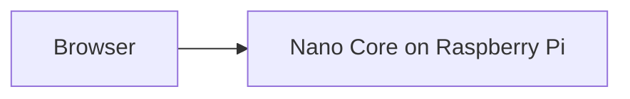

# Nano UI

Web front end for [Nano Core](https://github.com/JoniMustaniemi/nano-core). Open it in a browser to use Nano on the Raspberry Pi.

## How it works

Nano UI runs in the browser. Nano Core runs on the Raspberry Pi. Together they handle chat, voice, timers, calendar, and the rest.

## What Nano can do

### Chat and voice

- **Text** — type a message and get a reply on screen
- **Voice** — say “hey nano”, then ask or command; Nano can speak back on the Raspberry Pi speaker
- **Push-to-talk** — hold the mic button to speak from the browser when voice is available
- **Follow-ups** — Nano can ask yes/no questions or wait for a short answer (for example when confirming something)
- **Presence checks** — Nano can ask if you are there before continuing with something sensitive

### Timers and stopwatches

- Set **countdown timers** and get notified when they finish
- Run **stopwatches** and stop them when done
- Rename, cancel, or clear timers from the screen

### Calendar and weather

- Connect a **Google Calendar** account on the Raspberry Pi and browse events in month, week, or day view
- Switch between calendars from the screen
- See **current weather** using your browser’s location

### Memory and files

- Review **internal follow-up notes** Nano keeps for later
- **Wipe stored data** after you confirm — useful when you want a fresh start
- Ask Nano to **read, write, and list files** in its workspace, or run small scripts locally (through chat or voice)

### Stay informed

- See what Nano is doing: standby, working, or if something went wrong
- Open **Brains** to read the activity log and see what happened behind the scenes
- Run a **health check** or **system analysis** and get a plain-language report on database, voice, model, and hardware
- Check **CPU temperature** on the Raspberry Pi
- See the **clock** and **Nano version**

### When Nano starts up

- On the Raspberry Pi, Nano can **check for updates** when it starts and pull the latest version automatically
- If the connection drops after a **restart** or **reboot**, the page waits and reconnects when Nano is back

### System actions

With confirmation, you can ask Nano to:

- **Restart** the Nano service on the Raspberry Pi
- **Reboot** the Raspberry Pi

## Hosting

The site is static and can be hosted anywhere. Requests are forwarded to the Raspberry Pi.
