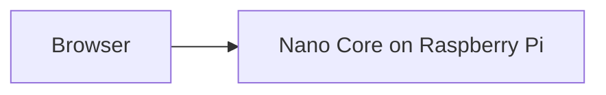

# Nano UI

Web front end for [Nano Core](https://github.com/). Shows status and sends commands to the Raspberry Pi API.

## How it works

You open Nano UI in a browser. It talks to Nano Core on the Raspberry Pi for chat, voice, timers, and everything else.

## Hosting

The site is static and can be hosted anywhere. API requests are forwarded to the Raspberry Pi.
